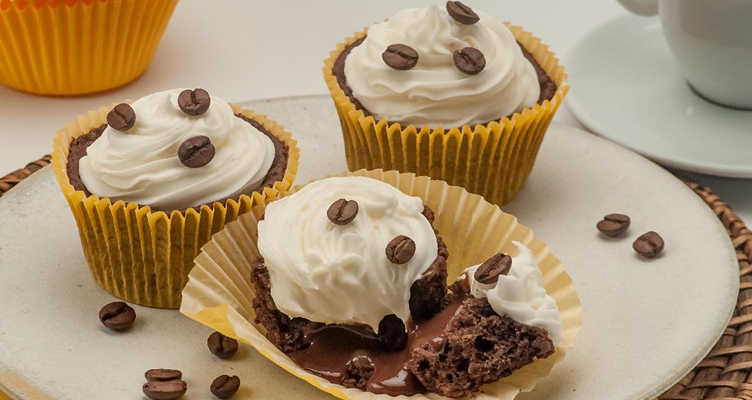

<h1 align="center"> Projeto 🧁 Página de Receita </h1>

Projeto de desenvolvimento web inspirado no universo da gastronomia.  
O <strong>Página de Receita</strong> apresenta de forma clara e organizada a receita de um delicioso <em>cupcake de café com chantilly</em>, trazendo seções bem estruturadas para ingredientes, modo de preparo e informações adicionais.  
Este projeto une meu aprendizado em <strong>HTML</strong> e <strong>CSS</strong> com a proposta de criar uma página prática e visualmente agradável para amantes da culinária.

  <a href="#-tecnologias">Tecnologias</a>&nbsp;&nbsp;&nbsp;|&nbsp;&nbsp;&nbsp;
  <a href="#-projeto">Projeto</a>&nbsp;&nbsp;&nbsp;|&nbsp;&nbsp;&nbsp;
  <a href="#-layout">Layout</a>&nbsp;&nbsp;&nbsp;

  

## 🚀 Tecnologias

Esse projeto foi desenvolvido com as seguintes tecnologias:

- HTML5  
- CSS3  
- Google Fonts (Alice)

## 💻 Projeto

Este projeto foi desenvolvido com foco em praticar conceitos fundamentais de front-end, como:

- Estruturação semântica em HTML  
- Estilização com CSS  
- Uso de listas não ordenadas para ingredientes  
- Criação de seções bem definidas para melhorar a experiência do usuário  

## 🔖 Layout

O projeto apresenta um design limpo e acolhedor, valorizando a leitura e a organização dos conteúdos culinários.  
Você pode visualizar o layout do projeto através [DESSE LINK](https://renatamayra.github.io/projetoreceita/).  

---

Feito com ♥ por Renata Mayra ✨
